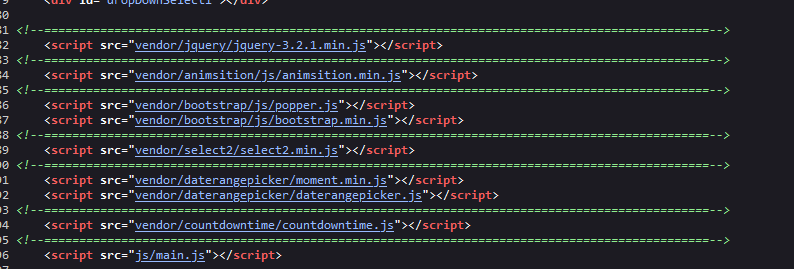
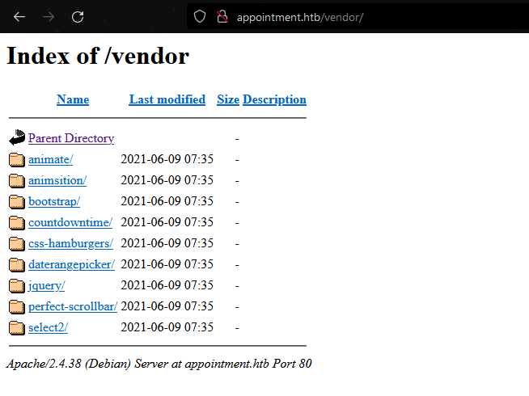

## Appointment
## Very Easy


## Start (03Sept2023)

- Nmap:

  ```bash

  nmap -sV -sC -oN appointment_main.nmap appointment.htb

  Starting Nmap 7.93 ( https://nmap.org ) at 2023-09-03 20:13 EDT
  Nmap scan report for appointment.htb (10.129.188.208)
  Host is up (0.21s latency).
  Not shown: 999 closed tcp ports (conn-refused)
  PORT   STATE SERVICE VERSION
  80/tcp open  http    Apache httpd 2.4.38 ((Debian))
  |_http-title: Login
  |_http-server-header: Apache/2.4.38 (Debian)

  Service detection performed. Please report any incorrect results at https://nmap.org/submit/ .
  Nmap done: 1 IP address (1 host up) scanned in 33.21 seconds

  nmap -sV -sC -p- -oN appointment.nmap appointment.htb


  Starting Nmap 7.93 ( https://nmap.org ) at 2023-09-03 20:11 EDT
  Stats: 0:13:38 elapsed; 0 hosts completed (1 up), 1 undergoing Connect Scan
  Connect Scan Timing: About 83.20% done; ETC: 20:27 (0:02:45 remaining)
  Nmap scan report for appointment.htb (10.129.188.208)
  Host is up (0.25s latency).
  Not shown: 65534 closed tcp ports (conn-refused)
  PORT   STATE SERVICE VERSION
  80/tcp open  http    Apache httpd 2.4.38 ((Debian))
  |_http-title: Login
  |_http-server-header: Apache/2.4.38 (Debian)

  Service detection performed. Please report any incorrect results at https://nmap.org/submit/ .
  Nmap done: 1 IP address (1 host up) scanned in 948.79 seconds

  ```

- looks to be a webapp or something, trying to login
- 
- Okay it is a web app, checking it out:
  - no "admin" page that obvious (http://appointment.htb/admin), or robots.txt
  - checking source:
  - 
  - looks like it is javascript based
  - wonder what is in the "vender" dir
  - 
  - Okay a directory listing, doens't really contain anything interesting, just looks like it is for javascripts stuffs, but it does show that "dance" of this webserver
  - Trying other stuffs

- Nikto
```bash


nikto -h appointment.htb


- Nikto v2.5.0
---------------------------------------------------------------------------
+ Target IP:          10.129.188.208
+ Target Hostname:    appointment.htb
+ Target Port:        80
+ Start Time:         2023-09-03 20:22:28 (GMT-4)
---------------------------------------------------------------------------
+ Server: Apache/2.4.38 (Debian)
+ /: The anti-clickjacking X-Frame-Options header is not present. See: https://developer.mozilla.org/en-US/docs/Web/HTTP/Headers/X-Frame-Options
+ /: The X-Content-Type-Options header is not set. This could allow the user agent to render the content of the site in a different fashion to the MIME type. See: https://www.netsparker.com/web-vulnerability-scanner/vulnerabilities/missing-content-type-header/
+ No CGI Directories found (use '-C all' to force check all possible dirs)
+ /images: The web server may reveal its internal or real IP in the Location header via a request to with HTTP/1.0. The value is "127.0.0.1". See: http://cve.mitre.org/cgi-bin/cvename.cgi?name=CVE-2000-0649
+ Apache/2.4.38 appears to be outdated (current is at least Apache/2.4.54). Apache 2.2.34 is the EOL for the 2.x branch.
+ /: Web Server returns a valid response with junk HTTP methods which may cause false positives.
+ /css/: Directory indexing found.
+ /css/: This might be interesting.
+ /images/: Directory indexing found.
+ /icons/README: Apache default file found. See: https://www.vntweb.co.uk/apache-restricting-access-to-iconsreadme/
+ 7963 requests: 0 error(s) and 9 item(s) reported on remote host
+ End Time:           2023-09-03 20:40:09 (GMT-4) (1061 seconds)
---------------------------------------------------------------------------
+ 1 host(s) tested


```

- gobuster

```
gobuster dir -u http://appointment.htb -w /usr/share/wordlists/dirbuster/directory-list-2.3-medium.txt


N/A

gobuster dir -u http://appointment.htb/vendor -w /usr/share/wordlists/dirbuster/directory-list-2.3-medium.txt


N/A
```


- Okay, not getting much, while my go busters run going to try some burp to see what web requests looks like.. didn't really give me much

- Tried basic SQL injection:
- 
- and this worked, my flag was reveiled from this

## ROOT.txt: e3d0796d002a446c0e622226f42e9672